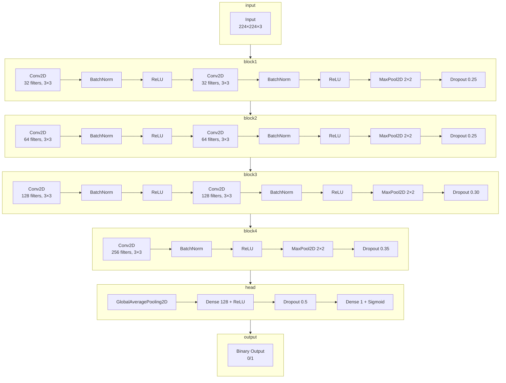

# skin-lesion-classification-scratchcnn-tl-gradcam
This project is dedicated to the development and comparison of three deep learning models for binary classification of skin lesions, based on the ISIC 2018-based Binary Classification Dataset (preprocessed and augmented).

The work implements a complete pipeline: from preprocessing "raw" images to training models from scratch and utilizing transfer learning, as well as interpreting their decisions using Grad-CAM.

### Project Goals

1. Build an end-to-end pipeline for dermatoscopic image classification.
2. Train three architectures:
   - Scratch CNN: A custom-built architecture trained from the ground up;
   - MobileNet
   - EfficientNet
3. Compare their performance based on the following metrics: Accuracy, Precision, Recall, F1-score, and ROC-AUC.
4. Visualize model attention using Grad-CAM and analyze which areas of the image the models focus on.

## 1. Data Preparation

The binary ISIC 2018 dataset was loaded from Hugging Face, containing two balanced classes (0 and 1). The data was split using a stratified approach into training (70%), validation (15%), and testing (15%) subsets.

## 2. Image Preprocessing

An image preprocessing pipeline was implemented using `tf.data`, which includes JPEG decoding, pixel normalization to the [0,1] range, and resizing to 224 x 224. An automatic black-border cropping function was added, and an attempt was made to remove microscope artifacts using morphological operation. 

## 3. Data Augmentation

Data Augmentation was performed using a set of transformations from `tf.keras.layers`: rendom flips, rotations (5%), zoom (10%), as well as minimal adjustments to brightness and contrast (lower than 1%) with subsequent value clipping to the valid range. The pipeline supports caching, parallel processing, and data prefetching to accelerate training.

## 4. Augmentation Visualization

Augmentations were visualized by displaying three pairs of original and augmented images, confirming that the semantics were preserved and transformation were applied correctly.

## 5. Building the Scratch CNN Architecture

Based on the proposed architecture, a convolutional neural network was built from the ground up. The model consists of four convolutional blocks featuring BatchNormalization, ReLU, MaxPooling, and Dropout. It concludes with a GlobalAveragePooling layer and two fully connected (Dense) layers with Dropout for regularization. The output layer contains a single neuron with a sigmoid activation function for binary classification. The model is ready for compilation and training.

