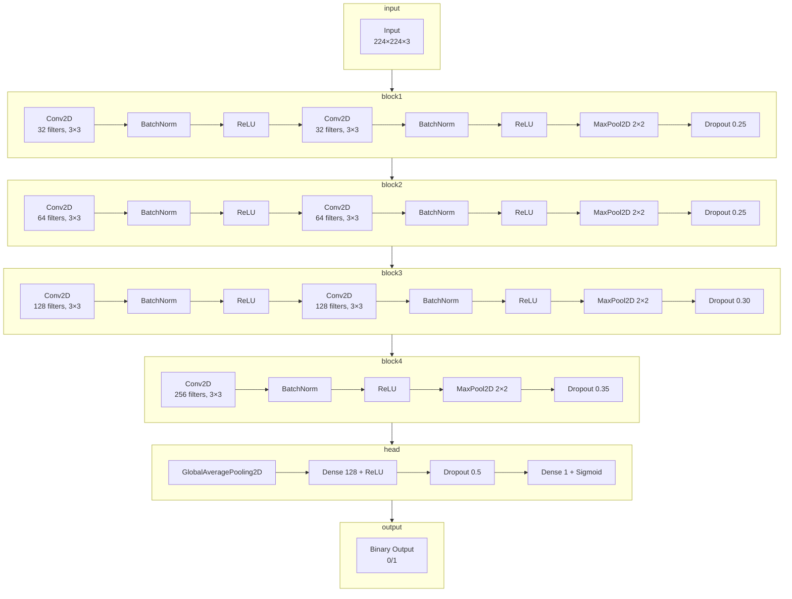

# skin-lesion-classification-scratchcnn-tl-gradcam
This project is dedicated to the development and comparison of three deep learning models for binary classification of skin lesions, based on the ISIC 2018-based Binary Classification Dataset (preprocessed and augmented).

The work implements a complete pipeline: from preprocessing "raw" images to training models from scratch and utilizing transfer learning, as well as interpreting their decisions using Grad-CAM.


### Project Goals

1. Build an end-to-end pipeline for dermatoscopic image classification.
2. Train three architectures:
   - Scratch CNN: A custom-built architecture trained from the ground up;
   - MobileNet
   - EfficientNet
3. Compare their performance based on the following metrics: Accuracy, Precision, Recall, F1-score, and ROC-AUC.
4. Visualize model attention using Grad-CAM and analyze which areas of the image the models focus on.

## 1. Data Preparation

The binary ISIC 2018 dataset was loaded from Hugging Face, containing two balanced classes (0 and 1). The data was split using a stratified approach into training (70%), validation (15%), and testing (15%) subsets.

## 2. Image Preprocessing

An image preprocessing pipeline was implemented using `tf.data`, which includes JPEG decoding, pixel normalization to the [0,1] range, and resizing to 224 x 224. An automatic black-border cropping function was added, and an attempt was made to remove microscope artifacts using morphological operation. 

## 3. Data Augmentation

Data Augmentation was performed using a set of transformations from `tf.keras.layers`: rendom flips, rotations (5%), zoom (10%), as well as minimal adjustments to brightness and contrast (lower than 1%) with subsequent value clipping to the valid range. The pipeline supports caching, parallel processing, and data prefetching to accelerate training.

## 4. Augmentation Visualization

Augmentations were visualized by displaying three pairs of original and augmented images, confirming that the semantics were preserved and transformation were applied correctly.

## 5. Building the Scratch CNN Architecture

A convolutional neural network was built from scratch according to the assignment specification. Based on the proposed architecture, the model consists of four convolutional blocks featuring BatchNormalization, ReLU, MaxPooling, and Dropout. It concludes with a GlobalAveragePooling layer and two fully connected (Dense) layers with Dropout for regularization. The output layer contains a single neuron with a sigmoid activation function for binary classification. The model is compiled and trained.



The architecture consists of four sequential convolutional blocks followed by classification layers.

### Architectural Details:
```python
def build_scratch_cnn(input_shape=(224, 224, 3)):
  model = models.Sequential()

  # blok-1
  model.add(layers.Conv2D(32, (3, 3), padding='same', input_shape=input_shape))
  model.add(layers.BatchNormalization())
  model.add(layers.ReLU())
  model.add(layers.Conv2D(32, (3,3), padding='same'))
  model.add(layers.BatchNormalization())
  model.add(layers.ReLU())
  model.add(layers.MaxPooling2D((2,2)))
  model.add(layers.Dropout(0.25))

  # blok-2
  model.add(layers.Conv2D(64, (3,3), padding='same'))
  model.add(layers.BatchNormalization())
  model.add(layers.ReLU())
  model.add(layers.Conv2D(64, (3,3), padding='same'))
  model.add(layers.BatchNormalization())
  model.add(layers.ReLU())
  model.add(layers.MaxPooling2D((2,2)))
  model.add(layers.Dropout(0.25))

  # blok-3
  model.add(layers.Conv2D(128, (3,3), padding='same'))
  model.add(layers.BatchNormalization())
  model.add(layers.ReLU())
  model.add(layers.Conv2D(128, (3,3), padding='same'))
  model.add(layers.BatchNormalization())
  model.add(layers.ReLU())
  model.add(layers.MaxPooling2D((2,2)))
  model.add(layers.Dropout(0.3))

  # blok-4
  model.add(layers.Conv2D(256, (3,3), padding='same'))
  model.add(layers.BatchNormalization())
  model.add(layers.ReLU())
  model.add(layers.MaxPooling2D((2,2)))
  model.add(layers.Dropout(0.35))

  # head
  model.add(layers.GlobalAveragePooling2D())
  model.add(layers.Dense(128, activation='relu'))
  model.add(layers.Dropout(0.5))
  model.add(layers.Dense(1, activation='sigmoid'))

  return model
```

4 main convolutional blocks, each containing:
- Conv2D with 3x3 kernels to extract local features and generate feature maps;
- BatchNormalization to normalize activations, accelerate convergence, and stabilize training;
- ReLU as the activation function to provide non-linearity and address the vanishing gradient problem;
- MaxPooling2D with a 2x2 window to reduce spatial dimensions and retain dominant features;
- Dropout with increasing probability (0.25 -> 0.35) for regularization and to prevent overfitting.

Head:
- ClobalAveragePooling2D to average each feature map across spatial dimensions, obtaining a fixed-length vector and reducing the number of paramenters;
- Dense(128) fully connected layer with ReLU activation and Dropout(0.5);
- Dense(1) output layer with sigmoid activation for binary classification.

### Model Configuration and Training Performance

The model architecture comprises 618,017 total parameters, with 616,129 of them being trainable. It is designed to process RGB images with an input size of `224x224x3`, ultimately producing a single probability value un the range of [0,1] for class 1 prediction.

For the training strategy, the model was complied using the Adam optimizer with a learning rate of 10^(-3) and binary cross-entropy as the loss function. To optimize the process, several callbacks were integrated: **TensorBoard** was utilized for real-time visualization of metrics and weight distributions, while EarlyStopping (with a patience of 10 epochs) was employed to prevent overfitting by restoring the best weights. Additionally, ReduceLROnPlateau was implemented to adaptively scale down the learning rate if the validation loss stagnated. Although the maximum limit was set to 100 epochs, the training session was terminated early by the automated monitoring system.


