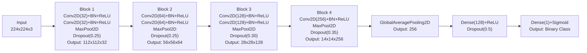

# skin-lesion-classification-scratchcnn-tl-gradcam
This project is dedicated to the development and comparison of three deep learning models for binary classification of skin lesions, based on the ISIC 2018-based Binary Classification Dataset (preprocessed and augmented).

The work implements a complete pipeline: from preprocessing "raw" images to training models from scratch and utilizing transfer learning, as well as interpreting their decisions using Grad-CAM.


### Project Goals

1. Build an end-to-end pipeline for dermatoscopic image classification.
2. Train three architectures:
   - Scratch CNN: A custom-built architecture trained from the ground up;
   - MobileNet
   - EfficientNet
3. Compare their performance based on the following metrics: Accuracy, Precision, Recall, F1-score, and ROC-AUC.
4. Visualize model attention using Grad-CAM and analyze which areas of the image the models focus on.

## 1. Data Preparation

The binary ISIC 2018 dataset was loaded from Hugging Face, containing two balanced classes (0 and 1). The data was split using a stratified approach into training (70%), validation (15%), and testing (15%) subsets.

## 2. Image Preprocessing

An image preprocessing pipeline was implemented using `tf.data`, which includes JPEG decoding, pixel normalization to the [0,1] range, and resizing to 224 x 224. An automatic black-border cropping function was added, and an attempt was made to remove microscope artifacts using morphological operation. 

## 3. Data Augmentation

Data Augmentation was performed using a set of transformations from `tf.keras.layers`: rendom flips, rotations (5%), zoom (10%), as well as minimal adjustments to brightness and contrast (lower than 1%) with subsequent value clipping to the valid range. The pipeline supports caching, parallel processing, and data prefetching to accelerate training.

## 4. Augmentation Visualization

Augmentations were visualized by displaying three pairs of original and augmented images, confirming that the semantics were preserved and transformation were applied correctly.

## 5. Building the Scratch CNN Architecture

A convolutional neural network was built from scratch according to the assignment specification. Based on the proposed architecture, the model consists of four convolutional blocks featuring BatchNormalization, ReLU, MaxPooling, and Dropout. It concludes with a GlobalAveragePooling layer and two fully connected (Dense) layers with Dropout for regularization. The output layer contains a single neuron with a sigmoid activation function for binary classification. The model is compiled and trained.



The architecture consists of four sequential convolutional blocks followed by classification layers.

### Architectural Details:
```python
def build_scratch_cnn(input_shape=(224, 224, 3)):
  model = models.Sequential()

  # blok-1
  model.add(layers.Conv2D(32, (3, 3), padding='same', input_shape=input_shape))
  model.add(layers.BatchNormalization())
  model.add(layers.ReLU())
  model.add(layers.Conv2D(32, (3,3), padding='same'))
  model.add(layers.BatchNormalization())
  model.add(layers.ReLU())
  model.add(layers.MaxPooling2D((2,2)))
  model.add(layers.Dropout(0.25))

  # blok-2
  model.add(layers.Conv2D(64, (3,3), padding='same'))
  model.add(layers.BatchNormalization())
  model.add(layers.ReLU())
  model.add(layers.Conv2D(64, (3,3), padding='same'))
  model.add(layers.BatchNormalization())
  model.add(layers.ReLU())
  model.add(layers.MaxPooling2D((2,2)))
  model.add(layers.Dropout(0.25))

  # blok-3
  model.add(layers.Conv2D(128, (3,3), padding='same'))
  model.add(layers.BatchNormalization())
  model.add(layers.ReLU())
  model.add(layers.Conv2D(128, (3,3), padding='same'))
  model.add(layers.BatchNormalization())
  model.add(layers.ReLU())
  model.add(layers.MaxPooling2D((2,2)))
  model.add(layers.Dropout(0.3))

  # blok-4
  model.add(layers.Conv2D(256, (3,3), padding='same'))
  model.add(layers.BatchNormalization())
  model.add(layers.ReLU())
  model.add(layers.MaxPooling2D((2,2)))
  model.add(layers.Dropout(0.35))

  # head
  model.add(layers.GlobalAveragePooling2D())
  model.add(layers.Dense(128, activation='relu'))
  model.add(layers.Dropout(0.5))
  model.add(layers.Dense(1, activation='sigmoid'))

  return model
```

4 main convolutional blocks, each containing:
- Conv2D with 3x3 kernels to extract local features and generate feature maps;
- BatchNormalization to normalize activations, accelerate convergence, and stabilize training;
- ReLU as the activation function to provide non-linearity and address the vanishing gradient problem;
- MaxPooling2D with a 2x2 window to reduce spatial dimensions and retain dominant features;
- Dropout with increasing probability (0.25 -> 0.35) for regularization and to prevent overfitting.

Head:
- ClobalAveragePooling2D to average each feature map across spatial dimensions, obtaining a fixed-length vector and reducing the number of paramenters;
- Dense(128) fully connected layer with ReLU activation and Dropout(0.5);
- Dense(1) output layer with sigmoid activation for binary classification.

### Model Configuration and Training Performance

The model architecture comprises 618,017 total parameters, with 616,129 of them being trainable. It is designed to process RGB images with an input size of `224x224x3`, ultimately producing a single probability value in the range of [0,1] for class 1 prediction.

For the training strategy, the model was complied using the Adam optimizer with a learning rate of 10^(-3) and binary cross-entropy as the loss function. To optimize the process, several callbacks were integrated: **TensorBoard** was utilized for real-time visualization of metrics and weight distributions, while EarlyStopping (with a patience of 10 epochs) was employed to prevent overfitting by restoring the best weights. Additionally, ReduceLROnPlateau was implemented to adaptively scale down the learning rate if the validation loss stagnated. Although the maximum limit was set to 100 epochs, the training session was terminated early by the automated monitoring system.

The training progress was evaluated through visualized learning curves for both loss and accuracy across training and validation sets. Final performance on the test set was assessed using Accuracy, Precision, Recall, F1-score, and ROC-AUC metrics. A Confusion Matrix was also generated to provide a detailed analysis of correct versus incorrect predictions.

This model serves as a baseline for comparison with the more complex trasfer learning architectures (MobileNet and EfficientNet) to be implemented next.

## 6. MobileNetV2 for Transfer Learning

In accordance with the project requirements, MobileNetV2 was selected as the primary model for implementing transfer learning. This choice is justified by several critical architectural advantages that make it particalarly suitable for image classification.

### Inverted Residual Connections

Traditional residual connections follow an "expansion -> compressions -> expansion" scheme, but MobileNetV2 utilizes an inverted structure "compression → expansion → compression". As noted by Sandler et al. (2018), shortcuts connecting the bottlenecks perform significantly better than those connecting expanded layers, ensuring a more efficient gradient flow and improved overall performance. 


Figure from Sandler et al. (2018)

### Linear Bottlenecks

MobileNetV2 introduces linear bottlenecks instead of non-linear activations in its narrow layers. Research suggests that linear bottlenecks improve performance because non-linearity tends to destroy critical information when operating in low-dimensional spaces. By maintaining linearity in these layers, the model preserves more essential data throughout the feature extraction process.


Figure from Sandler et al. (2018)

Reference: MobileNetV2: Inverted Residuals and Linear Bottlenecks (CVPR 2018) https://arxiv.org/abs/1801.04381

## 7. EfficientNetB0 for Transfer Learning

EfficientNetB0 selected as the third model for transfer learning. The introduction to this model began with the Keras documentation website, which features eight version of EfficientNet. EfficientNetB0 was selected for this project as it is the base version of architecture.

The function for creating the model on the description page is presented as follows:
```python
keras.application.EfficientNetB0(
   include_top=True,
   weights="imagenet",
   input_tensor=None,
   input_shape=None,
   pooling=None,
   classes=1000,
   classifier_activation="softmax",
   name="efficientnetb0",
)
```

Each parameter is broken down below:
- include_top (True/False): determines the "head" of the model;
- weights (imagenet/None/custom): specifies the weight source;
- input_tensor: an optimal parameter used to pass an existing tensor from `layers.Input() directly into the model;
- input_shape: defines the input image dimensions (height, width, 3 channels);
- pooling (None/avg/max): sets the pooling mode when `include_top=False`;
- classes: the number of classification classes;
- classifier_activation: the activation function for the output layer. The default is softmax for probabilities. It can be set to None to return raw logits. When using pre-trained weights, only None or softmax are permitted;
- name: the designated name for the model within Keras.

For Keras Application input preprocessing is included as part of the model (via a Rescaling layer). Consequently, `keras.applications.efficientnet.preprocess_input` serves as a pass-through function. EfficientNet models expect inputs to be float tensor with pixel values in the [0, 255] range, as the model performs internal scaling.

Further research involved the original paper, "EfficientNet: Rethinking Model Scaling for Convolutional Neural Networks" (ICMP 2019).

### The EfficientNet Compound Scaling Method

The core innovation of EfficientNet is not merely a new architecture, but a fundamentally different approach to scaling models. Rather than arbitrarily increasing a single parameter (depth, width, or resolution), the authors proposed **compound scaling** — a simultaneous and balanced increase of all three dimensions using a fixed coefficient. 


Figure from Tan and Le (2019)

### The Scaling Problem

The authors analyzed various approaches to scaling convolutional networks and formulated a key problem: how exactly should a model be enlarged to achieve maximum accuracy gains without an unjustified increase in computational costs? 

### The First Key Finding

Researchers confirmed that increasing any single dimension (depth, width, or resolution) does indeed improve accuracy. However, they discovered a fundamental limitation: **the effect of scaling saturates quickly**. As a model grows larger, the accuracy gain from further increasing just one parameter diminishes.

To test their hypotheses, the authors conducted a series of experiments with compound scaling. For instance, they compared how width scaling performs under different network depths and resolutions. The result was telling:
- if only the network width (w) is increased while keeping depth (d=1.0) and resolution (r=1.0) constant, accuracy quickly reaches a plateau;
- however, if depth (d=2.0) and resolution (r=2.0) are increased simultaneously, width scaling yields nuch higher accuracy for the same computational  cost.

### The Secound Decisive Conclusion

Based on these experiments, the authors reached a critical conclusion: "To achieve better accuracy and efficiency, it is crucial to maintain a balance between all dimensions of the network — width, depth, and resolution — when scaling convolutional networks".

The authors proposed a new method of combined scaling. The essence is simple and elegant: a compound coefficient **φ** is introduced to uniformly scale all three dimensions according to the following formulas:
```text
depth: d = α^φ
width: w = β^φ
resolution: r = γ^φ
```

This is subject to the constraint: α · β² · γ² ≈ 2 where α ≥ 1, β ≥ 1, γ ≥ 1 are constraints determined by a small grid search on the base model.

The coefficient φ is user-defined and controls how many additional resources are allocated. Since convolutional operation increase computational cost quadratically with respect to width and resolutionm β and γ are squared in the formula. 

Why it works better? The authors compared Class Activation Maps (CAM) for several model scaled using different methods. All models were derived from the same baseline, EfficientNetB0, and had approximately four times more arithmetic operations than the original version. Images were selected randomly from the ImageNet validation set. The results clearly demonstrate the advantage of this approach:
- the model with compound scaling focuses on more revelent regions of the image and captures more object details;
- other scaling methods either lose fine details or fail to capture all objects within the image entirely. 

## 8. Final Evaluation on the Test Set

The three models were evaluated on the held-out test set using standard classification metrics: accuracy, precision, recall, F1-score, ROC-AUC. The results are summarized below.

| Model | Accuracy | Precision | Recall | F1-Score | ROC-AUC |
| :--- | :---: | :---: | :---: | :---: | :---: |
| Scratch CNN | 0.846690 | 0.823662 | 0.870916	 | 0.846631	 | 0.935297 |
| MobileNetV2 | 0.926442 | 0.937551 | 0.909163 | 0.923139 | 0.981997 |
| EfficientNetB0 | 0.514131 | 0.000000 | 0.000000 | 0.000000 | 0.676021 |

**Scratch CNN** was trained for 47 epochs. Training progress:
```text
Epoch 1/100
377/377 ━━━━━━━━━━━━━━━━━━━━ 80s 150ms/step - accuracy: 0.7217 - auc: 0.7888 - loss: 0.5687 - precision: 0.6911 - recall: 0.7947 - val_accuracy: 0.7379 - val_auc: 0.8645 - val_loss: 0.5012 - val_precision: 0.6572 - val_recall: 0.9625 - learning_rate: 0.0010
...
Epoch 47/100
377/377 ━━━━━━━━━━━━━━━━━━━━ 40s 105ms/step - accuracy: 0.8444 - auc: 0.9248 - loss: 0.3338 - precision: 0.8011 - recall: 0.9134 - val_accuracy: 0.8420 - val_auc: 0.9305 - val_loss: 0.3208 - val_precision: 0.8130 - val_recall: 0.8765 - learning_rate: 8.0000e-06
```
On the unseen data, the model demostrated balanced results: **Precision** of 0.823662 (82.4% of predicted Class 1 objects are indeed Class 1) and **Recall** of 0.870916 (the model detected 87.1% of all actual Class 1 objects). An **F1-score** of 0.846631 confirms a balance between precision and recall. An AUC of 0.935297 indicates ability to distinguish between classess. 

**MobileNetV2** was trained using transfer leraning with the architecture: base model (frozen) -> Dropout (0.3) -> Dense(128) -> Dropout(0.5) -> Dense(1). The model demonstrated performance from the first epoch and stopped training after 86 epoches with the following metrics:
```text
Epoch 1/100
377/377 ━━━━━━━━━━━━━━━━━━━━ 0s 135ms/step - accuracy: 0.7258 - auc: 0.7974 - loss: 0.5636 - precision: 0.7186 - recall: 0.7383
Epoch 1: val_loss improved from inf to 0.41747, saving model to mobile_feature_extraction_best.h5 
377/377 ━━━━━━━━━━━━━━━━━━━━ 103s 214ms/step - accuracy: 0.7259 - auc: 0.7976 - loss: 0.5634 - precision: 0.7187 - recall: 0.7384 - val_accuracy: 0.8022 - val_auc: 0.8912 - val_loss: 0.4175 - val_precision: 0.7743 - val_recall: 0.8367 - learning_rate: 0.0010
Epoch 86/100
376/377 ━━━━━━━━━━━━━━━━━━━━ 0s 93ms/step - accuracy: 0.8740 - auc: 0.9490 - loss: 0.2896 - precision: 0.8543 - recall: 0.8992
Epoch 86: ReduceLROnPlateau reducing learning rate to 8.000000525498762e-06.
```
After feature extraction, the final 25% of layers were unfrozen for fine-tuning. The model showed consistent improvement throughout training, achieving test metrics of 0.926442 accuracy, 0.937551 **Precision** (93.8% of predicted Class 1 objects are indeed Class 1) and 0.909163 **Recall** (the model detected 90.9% of all actual Class 1 objects). An **F1-score** of 0.923139 and **AUC** of 0.981997, making it the best-performing model in this study. 

**EfficientNetB0** encountered significant training difficalties. Despite using the same transfer learning approach (base model (frozen) -> Dropout (0.3) -> Dense (128) -> Dropout (0.5) -> Dense (1)), the model failed to learn. Both training and validation metrics remained near random guessing levels (accuracy ~0.51, AUC ~0.50), and the model never predicted class 1 (resulting in zero precision and recall). Variou attempts were made to resolve this issue, including modifying the architecture, adjusting learning rates, and fine-tuning, but none proved successful. 

### Confusion matrix

I visualize the confusion matrix for each of the three models to see specifically where they make mistakes.


The viaul analysis of the confusion matrices reveals the following performance characteristics for each model:

**Scratch CNN** model demonstrate a solid baseline performance. It successfully identified 1094 instances of class 0 and 1093 instances of calss 1. However, it shows a tendency toward False Positives (234) compared to False Negatives (162).

**MobileNetV2** is the clear top performer. It significantly increased correct predictions on the main diagonal (1252 for class 0 and 1141 for class 1). 

For **EfficientNetB0** matrix highlights a complete model collapse. The network has defaulted to a majority class strategy, predicting class 0 for 100% of the input data. With zero correct predictions for class 1, this model failed to learn.

### ROC curve

The ROC curve illustrates the diagnostic ability of the classifiers. Plotting all three curves on a single praph allows for a direct comparison: the closer the curve is to the top-left corner, the better the model.


### Classification report

The classification report provides a detailed breakdown of precision, recall, and f1-score for each individual class, along with the support.

Scratch CNN
| Class | Precision | Recall | F1-Score | Support |
| :--- | :---: | :---: | :---: | :---: |
| Class 0 | 0.87 | 0.82 | 0.85 | 1328 |
| Class 1 | 0.82 | 0.87 | 0.85 | 1255 |
| **Accuracy** | | | **0.85** | **2583** |
| **Macro Avg** | 0.85 | 0.85 | 0.85 | 2583 |
| **Weighted Avg** | 0.85 | 0.85 | 0.85 | 2583 |

MobileNetV2
| Class | Precision | Recall | F1-Score | Support |
| :--- | :---: | :---: | :---: | :---: |
| Class 0 | 0.92 | 0.94 | 0.93 | 1328 |
| Class 1 | 0.94 | 0.91 | 0.92 | 1255 |
| **Accuracy** | | | **0.93** | **2583** |
| **Macro Avg** | 0.93 | 0.93 | 0.93 | 2583 |
| **Weighted Avg** | 0.93 | 0.93 | 0.93 | 2583 |

EfficientNetB0
| Class | Precision | Recall | F1-Score | Support |
| :--- | :---: | :---: | :---: | :---: |
| Class 0 | 0.51 | 1.00 | 0.68 | 1328 |
| Class 1 | 0.00 | 0.00 | 0.00 | 1255 |
| **Accuracy** | | | **0.51** | **2583** |
| **Macro Avg** | 0.26 | 0.50 | 0.34 | 2583 |
| **Weighted Avg** | 0.26 | 0.51 | 0.35 | 2583 |

## 9. Gradient-weighted Class Activation Mapping

### Scratch CNN


### MobileNetV2


### EfficientNetB0


